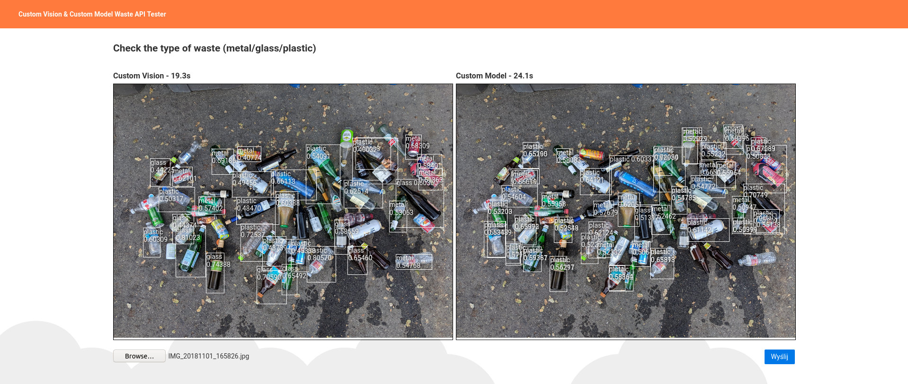
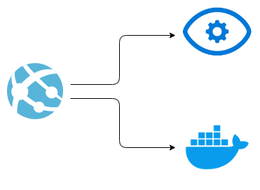
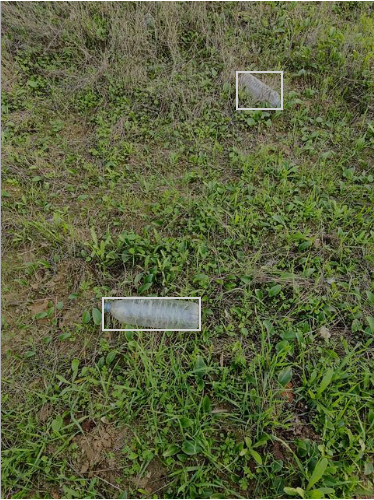

# Prosta Sortownia

Projekt zakłada rozpoznawanie i oddzielanie butelek plastikowych od butelek szklanych i puszek. Jest to wstępna wersja projektu zakładajacego przyszłościowe rozdzielanie wyrzucanych śmieci na wysypiskach czy w sortowniach, aby zautomatyzować pracę. Jednakże projekt możnaby także rozwinąć w stronę automatycznego barmana lub przy większej liczbie obiektów w automatycznego sprzedawcę sklepowego.



### Zespół

- Magdalena Kuna - GithHub: https://github.com/MagdalenaKuna
- Dawid Lubera - GitHub: https://github.com/Delpod

### Zadania

1. Implementacja - Stworzenie systemu predykcji w Custom Vision na portalu Azure oraz stworzenie modelu wykorzystaniem jezyka Python oraz biblioteki ImageAI, która korzysta z biblioteki TensorFlow do uczenia. Wybraliśmy to rozwiązanie, ponieważ sposób działania biblioteki wydawał się bardzo prosty i sposób uczenia i wykrywania pasował do naszych potrzeb.
2. Oba rozwiązania zostaną porównane pod kątem jakości rozwiązania, szybkości i poniesionych kosztów.
3. Wykrywanie obiektów - wykrywanie plastikowych (głównie butelek), szklanych i metalowych (głównie puszek) śmieci na zdjęciach.
4. Selekcja - rozróżnienie i zetykietowanie obiektów.

### Schemat

1. Wynik działą został udostępniony na stronie internetowej dostępnej pod adresem:

   https://waste-app.azurewebsites.net/

   Na stronie można wgrać zdjęcie i uzyskać wyniki z obu rozwiązań. API obsługujące model zostało zaimplementowane w języku Python z użyciem frameworku Flask, która została uruchomiiona jako WebAPP w kontenerze Dockera. Połączenie strona - Custom Vision i strona - Docker jest rozwiązane bezpośrednio w aplikacji.
2. Wytrenowany model można także pobrać tutaj:

   https://mkdlprojekt.blob.core.windows.net/files/model.h5

   Aby użyć modelu można użyć dołączonego [Notebooka](Przygotowanie_modelu.ipynb) aby sprawdzić poprawność działania - używa się do tego ImageAI.

### Architektura rozwiązania w chmurze



### Technologie

- Custom Vision Service - Azure
- ImageAI z TensorFlow i OpenCV
- Flask + Web Service z kontenerem Dockera
- Angular + Web Service z kontenerem

### Instrukcje reprodukcji

---

**Wstęp**

Do stworzenia własnego rozwiązania skorzystaliśmy z blbioteki [ImageAI](https://github.com/OlafenwaMoses/ImageAI), dlatego pierwszym krokiem jest instalacja tej biblioteki za pomocą komendy:

```
pip install imageai
```

Po zainstalowaniu ImageAI należy znaleźć odpowiednie zdjęcia, takie też znaleźliśmy na stronach dwóch projektów o podobnej tematyce:

https://github.com/pedropro/TACO/blob/master/data/all_image_urls.csv

i

https://raw.githubusercontent.com/jenkspt/recycle/master/data/recycle_coco/train.json

W obu skorzystaliśmy tylko ze zdjęc a nie z wykrytych obszarów.

Po pobraniu dużej ilości zdjęć wybraliśmy 684 z nich, które przedstawiały takie obiekty jakie chcieliśmy znaleźć. Zdjęcia należało je oznaczyć za pomocą programu [LabelImg](). Program ten tworzy adnotacje w formacie Pascal VOC, co okazało się niewielkim problem, ponieważ chcieliśmy użyć dokładnie tych samych oznaczeń w Custom Vision i jako, że jest to bardzo czasochłonne zajęcie, nie chcieliśmy robić tego po raz drugi. Więcej informacji będzie dalej.

Zdjęcia i adnotacje zostały podzielone na dane treningowe - 70% (478 zdjęć), walidacyjne - 24% (162 zdjęcia) i testowe 6% (44 zdjęcia).

**Własny model**

Utworzony został katalog `data` w którym stworzone zostały katalogi `train` i `validation`. W katalogach tych zostały utworzone kolejne katalogi `images` w którym zostały umieszczone wszystkie zdjęcia i `annotations` ze wszystkimi adnotacjami.

Mała ilość danych testowych wynika z tego, że obie zastosowane metody nie wymagają danych testowych do sprawdzenia jakości uczenia. Dane te miały służyć tylko do sprawdzania przez nas.

Błędem, który został popełniowy w fazie dobierania zdjęć i oznaczania była nierówna dystrybucja etykien `glass` / `plastic` / `metal`, ponieważ w danych treningowych i walidacyjnych `glass` występowało 105 razy, `metal` 227 razy, a `plastic` aż 331 razy. Różnica jest więc znaczna i nie jest dziwne, że etykieta `glass` jest rozponawana najgorzej.

Po utworzeniu danych w odpowieni sposób można było zająć się trenowaniem. Informacje na ten temat znajdują się w [Notebooku](Przygotowanie_modelu.ipynb).

Po utworzeniu modelu stworzone zostało api napisane z użyciem frameworka [Flask](https://flask.palletsprojects.com/), oraz skrypt [Dockerfile](). Projekt znajduje się w katalogu [docker-project](docker-project). W kodzie użyte zostały funkcje do wykrywania obiektów, które zostały też użyte i pokazane w Notebooku.

Obszary, w których znajdują wykryte obiekty zwracane są w formie jsona o następującej formie:

```
[
    {
        "box_points": {
            "height": 0.15478515625,
            "left": 0.20572916666666666,
            "top": 0.44384765625,
            "width": 0.1015625
        },
        "name": "plastic",
        "percentage_probability": 54.02476787567139
    },
    ...
]
```

Powtarzenie kroków opisanych poniżej, opisujących wgrywanie obrazu kontenera nie jest wymagana do uruchomienia API samemu, ponieważ waste-api jest dostępne publicznie w Docker Hub.

Aby samemu zbudować kontener dockera należy dostarczyć plik modelu który można pobrać [tutaj](https://mkdlprojekt.blob.core.windows.net/files/model.h5).

Gdy model został umieszczony w katalogu z Dockerfile i po kilku poprawkach, uruchomilismy komendy podane poniżej.

```
docker build .
docker tag 3709cb5e99d5 delpod/waste-api:4
docker push delpod/waste-api:4
```

Następnie w Azure utworzyliśmy Web App na maszynie B1, gdzie został uruchony kontener Dockera, użyliśmy archiwum Docker Hub i wskazaliśmy obraz `delpod/waste-api:4`.

Po jakimś czasie API stało się dostępne pod adresem:

https://waste-app.azurewebsites.net/

**Custom Vision**

Pojawił się pewien problem, ponieważ Custom Vision nie pozwala na wgrywanie plików Pascal VOC. Należało więc stworzyć skrypt, który pozwalałby na czytanie plików stworzonych za pomocą LabelImg oraz wgrywał zdjęcia z adnotacjami do Custom Vision za pomocą udostępnionego Training API.

Stworzony został projekt [pascal-voc-to-custom-vision-uploader](https://github.com/ProjektCustomVisionKL/pascal-voc-to-custom-vision-uploader), który udostępniony został w osobnym repozytorium na wypadek, gdyby ktoś inny potrzebował tego typu rozwiązania, a nie chciał go tworzyć samemu.

Utworzony został nowy projekt, a gdy zdjęcia zostały wgrane do Custom Vision sprawdziliśmy czy wszystko jest poprawnie zaznaczone. I wyniki działania skryptu wydawały się poprawne.



Nastepnie musieliśmy opublikować przetrenować projekt, z uwagi na to, że szkolenie jest bardzo drogie na Azure, a przy projekcie z Custom Vision odnieśliśmy wrażenie, że trenowanie 2-3 godziny daje gorsze rezultaty niż szybkie wybraliśmy trenowanie szybkie. Trenowanie pewnie z uwagi na ilość danych zajęło i tak ~1.5 godziny.

Po zakończeniu trenowania opublikowaliśmy projekt i stał on się dostępny przez Prediction API.

**Aplikacja pozwalająca na porównanie rozwiązań**

W Angularze stworzyliśmy kolejny projekt, którego kod dostępny jest w katalogu `waste-app`. Aplkacja pozwala na wybranie zdjęcia z komputera i wysłanie go zarówno do Prediction API jak i naszego API z serwerem. Jako próg wyświetlania ustawiliśmy prawdopodobieństwo 0.4 dla Custom Vision i 0.5 dla naszego API.

W Azure Portal stworzyliśmy kolejne Web App tym razem takie, które uruchamia kod PHP. Za pomocą połączenia FTP wgraliśmy zbudowany projekt Angularowy i jest on dostępny pod adresem:

https://waste-app.azurewebsites.net/

### Rezultaty


### Dalszy rozwój

Aby ulepszyć działanie obecnej aplikacji najłatwiejszym sposobem byłoby dłuższe trenowanie modelu. Jednakże aby dobrze dobrać odpowiednie wagi dobrze byłoby także sprawić, aby ilość oznaczonych obiektów poszczególnych tagów/etykiet była podobna, czyli potrzebne byłoby dodatkowo ok. 200 oznaczeć szkla i 100 oznaczeń metalu.

Innym sposobem na rozbudowę byłoby dodanie kolejnych możliwych sortowań czyli papieru, biodegradowalnych rzeczy i rzeczy, które nie nadają się do recyklingu. Mając dobrej jakości zdjęcia możnaby nawet czytać odpowiednie oznaczenia na śmieciach, co pozwalałoby na dokładniejszą analizę, np. oznaczenia na workach biodegradowalnych.

Kolejnym mozliwym ulepszeniem, tym razem architektonicznym byłoby użycie Video Indexera w Azure lub innego rozwiązania dla naszego modelu, które pozwalałyby na analizę na żywo np. taśmy w zakładzie recyklingu.

### Podsumowanie


### Plan

1. Znalezienie zdjęć - Dawid - do 13.12
2. Nauczenie Custom vision - Magda + Dawid - 30.12
3. Opracowanie własnego algorytmu - Magda + Dawid - 08.01
4. Drugi check-point - 30.01
5. Posklejanie wszystkiego w całość + prezentacja - 30.01
6. Przedstawienie wyników pracy - 30.01
