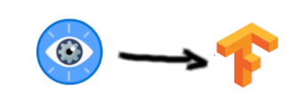

# PROSTA SORTOWNIA

Projekt zakłada rozpoznawanie i oddzielanie butelek plastikowych od butelek szklanych i puszek. Jest to wstępna wersja projektu zakładajacego przyszłościowe rozdzielanie wyrzucanych śmieci na wysypiskach czy w sortowniach, aby zautomatyzować pracę. Jednakże projekt możnaby także rozwinąć w stronę automatycznego barmana lub przy większej liczbie obiektów w automatycznego sprzedawcę sklepowego.

### ZESPÓŁ

- Magdalena Kuna - GithHub: https://github.com/MagdalenaKuna
- Dawid Lubera - GitHub: https://github.com/Delpod

### ZADANIA

1. Implementacja - Stworzenie systemu predykcji w Custom Vision na portalu Azure oraz stworzenie modelu wykorzystaniem jezyka Python oraz biblioteki ImageAI, która korzysta z biblioteki TensorFlow do uczenia.
2. Oba rozwiązania zostaną porównane pod kątem jakości rozwiązania, szybkości i poniesionych kosztów.
3. Wykrywanie obiektów - wykrywanie plastikowych (głównie butelek), szklanych i metalowych (głównie puszek) śmieci na zdjęciach.
4. Selekcja - rozróżnienie i zetykietowanie obiektów.

### SCHEMAT

1. Wynik działą został udostępniony na stronie internetowej dostępnej pod adresem:

   https://waste-app.azurewebsites.net/

   Na stronie można wgrać zdjęcie i uzyskać wyniki z obu rozwiązań. API obsługujące model zostało zaimplementowane w języku Python z użyciem frameworku Flask, która została uruchomiiona jako WebAPP w kontenerze Dockera. Połączenie strona - Custom Vision i strona - Docker jest rozwiązane bezpośrednio w aplikacji.
2. Wytrenowany model można także pobrać tutaj:

   https://mkdlprojekt.blob.core.windows.net/files/model.h5

   Aby użyć modelu można użyć dołączonego Notebooka aby sprawdzić poprawność działania - używa się do tego Tensorflow.

### ARCHITEKTURA

1:

2:

### TECHNOLOGIE

- Custom Vision Service - Azure
- ImageAI z TensorFlow i OpenCV
- Flask + Web Service z kontenerem Dockera
- Angular + Web Service z kontenerem

### PLAN

1. Znalezienie zdjęć - Dawid - do 13.12
2. Nauczenie Custom vision - Magda + Dawid - 30.12
3. Opracowanie własnego algorytmu - Magda + Dawid - 08.01
4. Wstępny 2 check-point do potwierdzenia
5. Posklejanie wszystkiego w całość + prezentacja
6. Przedstawienie wyników pracy
