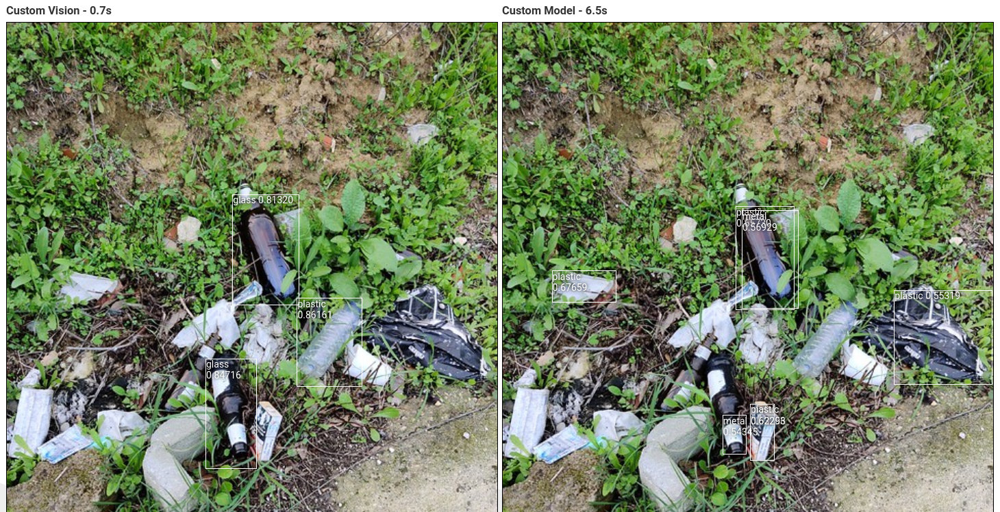

# Prosta Sortownia

Projekt zakłada rozpoznawanie i oddzielanie butelek plastikowych od butelek szklanych i puszek. Jest to wstępna wersja projektu zakładajacego przyszłościowe rozdzielanie wyrzucanych śmieci na wysypiskach czy w sortowniach, aby zautomatyzować pracę. Jednakże projekt możnaby także rozwinąć w stronę automatycznego barmana lub przy większej liczbie obiektów w automatycznego sprzedawcę sklepowego.


### Zespół

- Magdalena Kuna - GithHub: https://github.com/MagdalenaKuna
- Dawid Lubera - GitHub: https://github.com/Delpod

### Zadania

1. Implementacja - Stworzenie systemu predykcji w Custom Vision na portalu Azure oraz stworzenie modelu wykorzystaniem jezyka Python oraz biblioteki ImageAI, która korzysta z biblioteki TensorFlow do uczenia. Wybraliśmy to rozwiązanie, ponieważ sposób działania biblioteki wydawał się bardzo prosty i sposób uczenia i wykrywania pasował do naszych potrzeb.
2. Oba rozwiązania zostaną porównane pod kątem jakości rozwiązania, szybkości i poniesionych kosztów.
3. Wykrywanie obiektów - wykrywanie plastikowych (głównie butelek), szklanych i metalowych (głównie puszek) śmieci na zdjęciach.
4. Selekcja - rozróżnienie i zetykietowanie obiektów.

### Schemat

1. Wynik działą został udostępniony na stronie internetowej dostępnej pod adresem:

   https://waste-app.azurewebsites.net/

   Na stronie można wgrać zdjęcie i uzyskać wyniki z obu rozwiązań. API obsługujące model zostało zaimplementowane w języku Python z użyciem frameworku Flask, która została uruchomiiona jako WebAPP w kontenerze Dockera. Połączenie strona - Custom Vision i strona - Docker jest rozwiązane bezpośrednio w aplikacji.
2. Wytrenowany model można także pobrać tutaj:

   https://mkdlprojekt.blob.core.windows.net/files/model.h5

   Aby użyć modelu można użyć dołączonego [Notebooka](Przygotowanie_modelu.ipynb) aby sprawdzić poprawność działania - używa się do tego ImageAI.

### Architektura rozwiązania w chmurze


### Technologie

- Custom Vision Service - Azure
- ImageAI z TensorFlow i OpenCV
- Flask + Web Service z kontenerem Dockera
- Angular + Web Service z kontenerem

### Instrukcje reprodukcji

---

**Wstęp**

Do stworzenia własnego rozwiązania skorzystaliśmy z blbioteki [ImageAI](https://github.com/OlafenwaMoses/ImageAI), dlatego pierwszym krokiem jest instalacja tej biblioteki za pomocą komendy:

```
pip install imageai
```

Po zainstalowaniu ImageAI należy znaleźć odpowiednie zdjęcia, takie też znaleźliśmy na stronach dwóch projektów o podobnej tematyce:

https://github.com/pedropro/TACO/blob/master/data/all_image_urls.csv

i

https://raw.githubusercontent.com/jenkspt/recycle/master/data/recycle_coco/train.json

W obu skorzystaliśmy tylko ze zdjęc a nie z wykrytych obszarów.

Po pobraniu dużej ilości zdjęć wybraliśmy 684 z nich, które przedstawiały takie obiekty jakie chcieliśmy znaleźć. Zdjęcia należało je oznaczyć za pomocą programu [LabelImg](). Program ten tworzy adnotacje w formacie Pascal VOC, co okazało się niewielkim problem, ponieważ chcieliśmy użyć dokładnie tych samych oznaczeń w Custom Vision i jako, że jest to bardzo czasochłonne zajęcie, nie chcieliśmy robić tego po raz drugi. Więcej informacji będzie dalej.

Zdjęcia i adnotacje zostały podzielone na dane treningowe - 70% (478 zdjęć), walidacyjne - 24% (162 zdjęcia) i testowe 6% (44 zdjęcia).

**Własny model**

Utworzony został katalog `data` w którym stworzone zostały katalogi `train` i `validation`. W katalogach tych zostały utworzone kolejne katalogi `images` w którym zostały umieszczone wszystkie zdjęcia i `annotations` ze wszystkimi adnotacjami.

Mała ilość danych testowych wynika z tego, że obie zastosowane metody nie wymagają danych testowych do sprawdzenia jakości uczenia. Dane te miały służyć tylko do sprawdzania przez nas.

Błędem, który został popełniowy w fazie dobierania zdjęć i oznaczania była nierówna dystrybucja etykien `glass` / `plastic` / `metal`, ponieważ w danych treningowych i walidacyjnych `glass` występowało 105 razy, `metal` 227 razy, a `plastic` aż 331 razy. Różnica jest więc znaczna i nie jest dziwne, że etykieta `glass` jest rozponawana najgorzej.

Po utworzeniu danych w odpowieni sposób można było zająć się trenowaniem. Informacje na ten temat znajdują się w [Notebooku](Przygotowanie_modelu.ipynb).

Po utworzeniu modelu stworzone zostało api napisane z użyciem frameworka [Flask](https://flask.palletsprojects.com/), oraz skrypt [Dockerfile](). Projekt znajduje się w katalogu [docker-project](docker-project). W kodzie użyte zostały funkcje do wykrywania obiektów, które zostały też użyte i pokazane w Notebooku.

Obszary, w których znajdują wykryte obiekty zwracane są w formie jsona o następującej formie:

```
[
    {
        "box_points": {
            "height": 0.15478515625,
            "left": 0.20572916666666666,
            "top": 0.44384765625,
            "width": 0.1015625
        },
        "name": "plastic",
        "percentage_probability": 54.02476787567139
    },
    ...
]
```

Powtarzenie kroków opisanych poniżej, opisujących wgrywanie obrazu kontenera nie jest wymagana do uruchomienia API samemu, ponieważ waste-api jest dostępne publicznie w Docker Hub.

Aby samemu zbudować kontener dockera należy dostarczyć plik modelu który można pobrać [tutaj](https://mkdlprojekt.blob.core.windows.net/files/model.h5).

Gdy model został umieszczony w katalogu z Dockerfile i po kilku poprawkach, uruchomilismy komendy podane poniżej.

```
docker build .
docker tag 3709cb5e99d5 delpod/waste-api:4
docker push delpod/waste-api:4
```

Następnie w Azure utworzyliśmy Web App na maszynie B1, gdzie został uruchony kontener Dockera, użyliśmy archiwum Docker Hub i wskazaliśmy obraz `delpod/waste-api:4`.

Po jakimś czasie API stało się dostępne pod adresem:

https://waste-app.azurewebsites.net/

**Custom Vision**

Pojawił się pewien problem, ponieważ Custom Vision nie pozwala na wgrywanie plików Pascal VOC. Należało więc stworzyć skrypt, który pozwalałby na czytanie plików stworzonych za pomocą LabelImg oraz wgrywał zdjęcia z adnotacjami do Custom Vision za pomocą udostępnionego Training API.

Stworzony został projekt [pascal-voc-to-custom-vision-uploader](https://github.com/ProjektCustomVisionKL/pascal-voc-to-custom-vision-uploader), który udostępniony został w osobnym repozytorium na wypadek, gdyby ktoś inny potrzebował tego typu rozwiązania, a nie chciał go tworzyć samemu.

Utworzony został nowy projekt, a gdy zdjęcia zostały wgrane do Custom Vision sprawdziliśmy czy wszystko jest poprawnie zaznaczone. I wyniki działania skryptu wydawały się poprawne.


Nastepnie musieliśmy opublikować przetrenować projekt, z uwagi na to, że szkolenie jest bardzo drogie na Azure, a przy projekcie z Custom Vision odnieśliśmy wrażenie, że trenowanie 2-3 godziny daje gorsze rezultaty niż szybkie wybraliśmy trenowanie szybkie. Trenowanie pewnie z uwagi na ilość danych zajęło i tak ~1.5 godziny.

Po zakończeniu trenowania opublikowaliśmy projekt i stał on się dostępny przez Prediction API.

**Aplikacja pozwalająca na porównanie rozwiązań**

W Angularze stworzyliśmy kolejny projekt, którego kod dostępny jest w katalogu `waste-app`. Aplkacja pozwala na wybranie zdjęcia z komputera i wysłanie go zarówno do Prediction API jak i naszego API z serwerem. Jako próg wyświetlania ustawiliśmy prawdopodobieństwo 0.5 dla Custom Vision i dla naszego API.

W Azure Portal stworzyliśmy kolejne Web App tym razem takie, które uruchamia kod PHP. Za pomocą połączenia FTP wgraliśmy zbudowany projekt Angularowy i jest on dostępny pod adresem:

https://waste-app.azurewebsites.net/

### Rezultaty

Azure Custom Vision przedstawia trzy wskaźniki oceny klasyfikatorów.

* **Precision** - określa ile identyfikacji klasy było prawidłowych. W naszym przypadku może to być np. 100 wykryć plastiku, a tylko 65 z nich faktycznie było było poprawnych, wtedy precision wynosi 65%.

  P = TRUE_POSITIVE / (TRUE_POSITIVE + FALSE_POSITIVE)
* **Recall** - określa ile było faktycznych klasyfikacji które dodatkowo były poprawnie sklasyfikowane. W naszym przypadku może to być np. 100 zdjęć, które zostały przez nas określone jako plastik, a wykrytych jako plastik było tylko 40, wtedy recall wynosi 40%.

  R = TRUE_POSITIVE / (TRUE_POSITIVE + FALSE_NEGATIVE)
* **Average precision** - jest to pole pod krzywą w wykresie precision od recall dla każdej wartości progu wykrywania obiektu (od 0 do 1).

Wiecej informacji o metrykach można znaleźć w [artykule Uniwersytetu Stanford](https://cs230.stanford.edu/section/7/), gdzie jest to bardzo przystępnie opisane.

ImageAI pozwala poznać tylko jedną z tych wartości i jest to Average precision, więc względem tej wartości głównie będzie to porównane.


| Tag | Precision | Recall | Average precision Azure | Average precision ImageAI |
| - | - | - | - | - |
| glass | 76.5% | 40.6% | 48.0% | 42.6% |
| plastic | 73.6% | 39.8% | 45.2% | 33.9% |
| metal | 52.1% | 45.5% | 42.2% | 41.2% |

Niestety, ale od razu widać, że wartości uzyskane w Azure prezentują się tylko trochę lepiej od tych uzyskanych przez nasz model. Wynikać to może między innymi z tego, że obliczenia na Azure, mimo że znacznie krótsze zostały wykonane na zoptymalizowanej pod kątem tego typu obliczeń maszynie i była to maszyna znacznie szybsza.

Pod kątem samych surowych danych można uznać, że Custom Vision jest tutaj lepszy. Chcieliśmy zrobić porównania faktycznych zdjęć, aby zobaczyć jak działają porównania.

I. Pojedynczy łatwy do wyodrębnienia obiekt.


Jak widać, w tym wypadku oba modele równie dobrze wykryły śmieci, czas wykrywanie także jest porównywalny, jednakże widać, że Azure zrobił to ze znacznie większą pewnoscią ~ 0.92, a nasz model tylko ~0.65.

II. Kilka obiektów także z elementami, które nie były poprzednio zaznaczane gdyż skupiliśmy się głównie na butelkach



Widać tutaj, że elementy takie jakie celowaliśmy czyli butelki plastikowe i szklane zostały znacznie lepiej oznaczone jako śmieci konkretnego typu w przypadku Custom Viion, brak też dużych nakładających się na siebie obszarów. Jednakże, stworzony przez nas model wykrył śmieci także tam, gdzie nei było to poprzednio pokazywane - nie wszędzie oczywiście. Nie wykrył też poprawnie butelki na dole, a paczkę po papierosach sklasyfikował do najbliższej znajej etykiety - metalowi. Widać tutaj też znaczną różnicę w szybkości działania, gdzie zwycięsko wychodzi Azure.

III. Duża liczba obiektów różnego typu


Widać tutaj podobne błedy, nie wykrywanie wszystkich obiektów (szczególnie mało zostało wykrytych przez Custom Vision), błedne tagi przy niektórych z nich. Bardzo ciężko w tym wypadku porównać który z algorytmów zadziałął lepiej jeśli chodzi o wykrywanie - oba wypadły dość słabo. Widać jednak różnicę w szybkości działania.

Różnice w szybkości w większości prób mogą wiązać się z ilością dostępnej mocy obliczeniowej na maszynie Dockera, mimo wszystko jest to dość tania maszyna - koszt to tylko 12 dolarów miesięcznie. W przypadku korzystania z Azure koszt zależy głównie od ilości wykrywanych zdjęć. Custom Vision pozwala na wykrywanie do 10 000 zdjęć miesięcznie za darmo a potem, każdy 1000 kosztuje 2 dolary. Jeśli liczba wykrywanych obiektów ograniczyłaby się do 16 000 zdjęć, to Custom Vision wyszedłby taniej, powyżej tej liczby wirtualna maszyna byłaby lepsza, jednak silniejsze rozwiązania kosztują już ~70 dolarów, co wymagałoby 45 000 predykcji miesięcznie, aby cena Custom Vision była większa.

Istnieje takze duża szansa, że gdyby model był dodatkowo douczony, szczególnie gdyby było to zrobione na większej ilości zdjęć to zarówno jakość Azure Custom Vision jak i naszego rozwiązania byłaby lepsza.

### Dalszy rozwój

Aby ulepszyć działanie obecnej aplikacji najłatwiejszym sposobem byłoby dłuższe trenowanie modelu. Jednakże, aby model był trenowany poprawnie dobrze byłoby także sprawić, aby ilość oznaczonych obiektów poszczególnych tagów/etykiet była podobna, czyli potrzebne byłoby dodatkowo ok. 200 oznaczeć szkla i 100 oznaczeń metalu.

Innym sposobem na rozbudowę byłoby dodanie kolejnych możliwych sortowań czyli papieru, biodegradowalnych rzeczy i rzeczy, które nie nadają się do recyklingu. Mając dobrej jakości zdjęcia możnaby nawet czytać odpowiednie oznaczenia na śmieciach, co pozwalałoby na dokładniejszą analizę, np. oznaczenia na workach biodegradowalnych.

Kolejnym mozliwym ulepszeniem, tym razem architektonicznym byłoby użycie Video Indexera w Azure lub innego rozwiązania dla naszego modelu, które pozwalałyby na analizę na żywo np. taśmy w zakładzie recyklingu.

### Podsumowanie

W projekcie mieliśmy szansę stworzyć samemu model detekcji elementów na obrazach jak i użyć rozwiązania Custom Vision, a następnie dokonać porównania. Doszliśmy do wniosku, że aby rozwiązanie działało poprawnie wymagany byłby dalszy rozwój oraz douczanie stworzonych modeli. Jeśli chodzi o koszta, to w przypadku niskiego użycia interfejsu metoda z Custom Vision jest znacznie tańsza, jednak cena szybko rośnie, jeśli wykonywanych zdjęć miałyby być tysiące.

Oba rozwiązania mają swoje plusy i minusy i od zastosowania zależy to, które byłoby lepsze do dalszego rozwoju.

### Plan

1. Znalezienie zdjęć - Dawid - do 13.12
2. Nauczenie Custom vision - Magda + Dawid - 30.12
3. Opracowanie własnego algorytmu - Magda + Dawid - 08.01
4. Drugi check-point - 30.01
5. Posklejanie wszystkiego w całość + prezentacja - 30.01
6. Przedstawienie wyników pracy - 30.01
